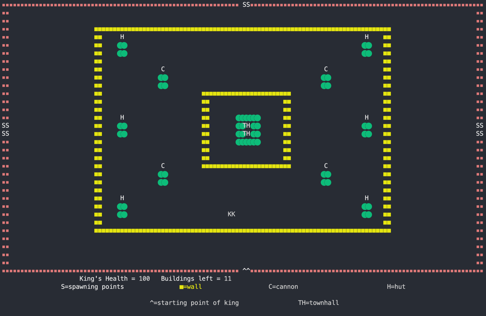

Used OS concepts:
1. Multi-threading (threading)
2. Asynchronous I/O (asyncio)
5. system features like time, memory(os)

Used OOPS concepts:

1. Encapsulation
when I created a class, it means I am implementing encapsulation. 

2. Inheritance 
Parent class subclass like building and hut

3. Abstraction
Making method functions like move for class king 

4. Polymorphism
Making 2 classes have a method function with same name , need not have same arguments
e.g king and barbarian both have move method 

Some extra Features : 
1. sound of killing, hitting and winning
2. replays of any match 
3. replays with different speed
4. king's lavethian axe